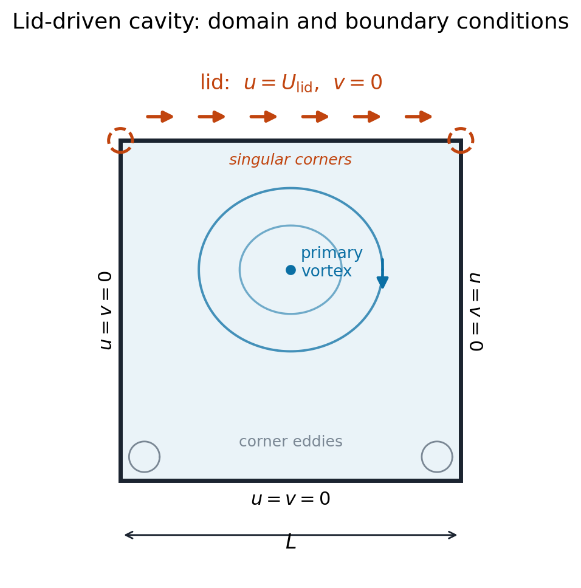
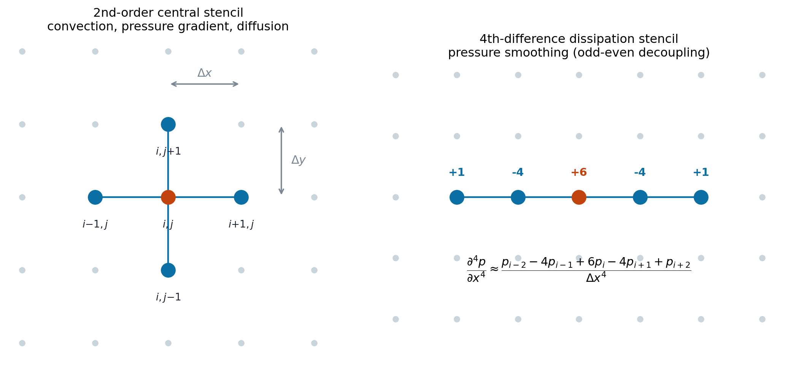
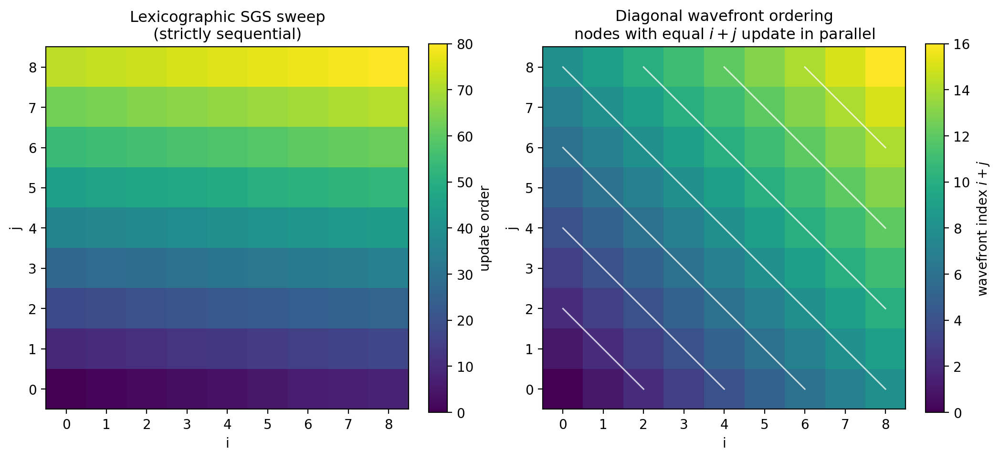
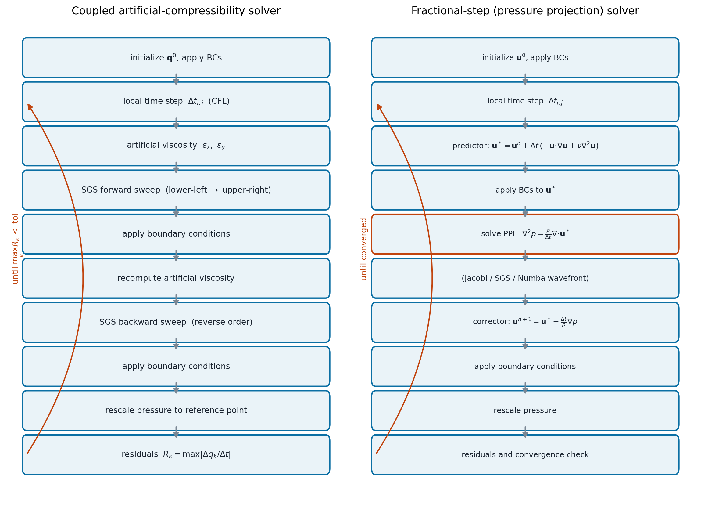
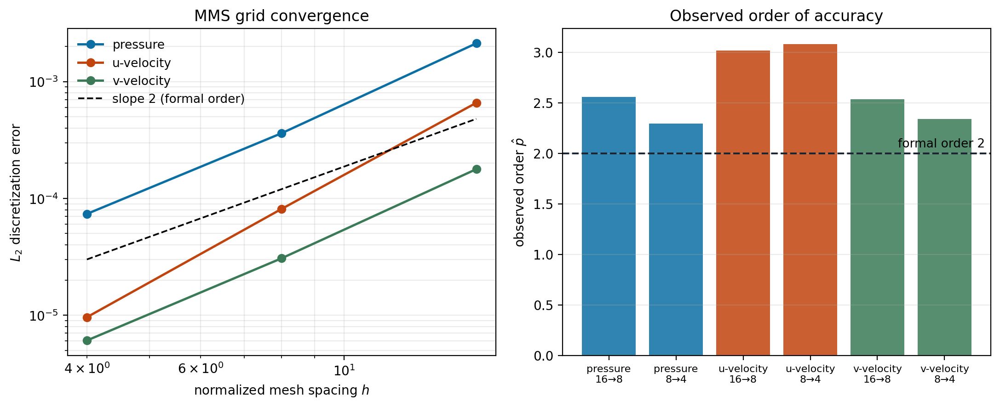
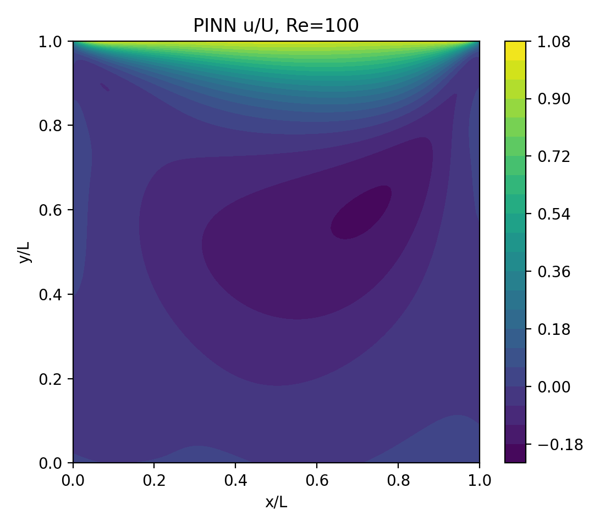
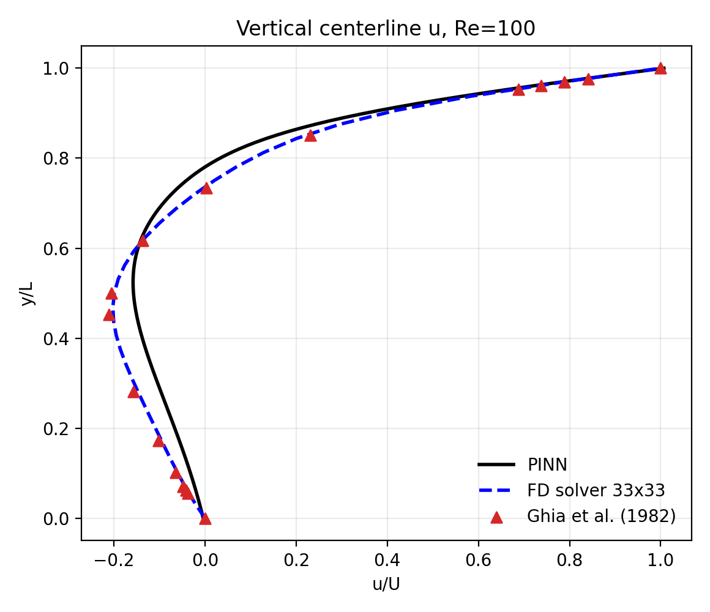
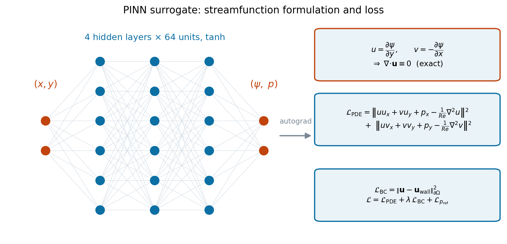
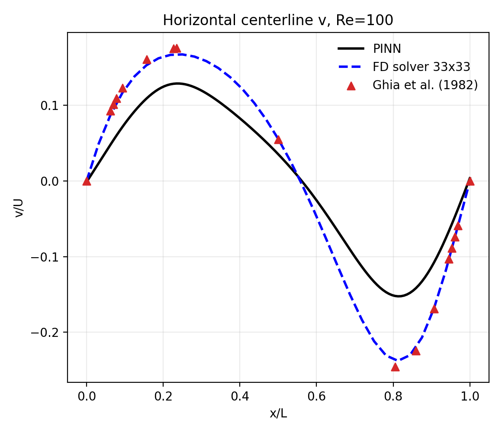
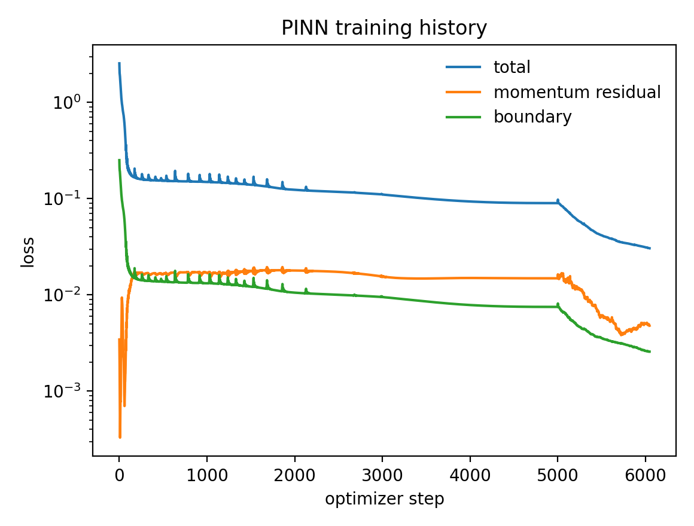

# 2D Lid-Driven Cavity Flow Solver

**MAE 4100/5100 Course Project 2 — Numerical Methods and AI for CFD**

A Python implementation of a two-dimensional incompressible Navier–Stokes solver for the classic lid-driven cavity problem, built from scratch on a finite-difference discretization. The project implements and compares two solution strategies:

- **Coupled artificial-compressibility solver** — the density-based pseudo-time approach with time-derivative preconditioning, solved with point Jacobi or symmetric Gauss-Seidel (SGS) iterations.
- **Fractional-step (pressure-projection) solver** — the pressure-based approach: intermediate velocity prediction, a pressure Poisson equation (PPE) solve, and a divergence-free velocity correction.

Both paths support serial loops, NumPy-vectorized kernels, and Numba-accelerated SGS sweeps using diagonal wavefront ordering for parallelism. The solver is verified with the Method of Manufactured Solutions (MMS), validated against the Ghia, Ghia & Shin (1982) benchmark data, and cross-checked against an OpenFOAM simulation of the same cavity.

<p align="center">
  
  
</p>

## Contents

- [Problem Description](#problem-description)
- [Mathematical Formulation](#mathematical-formulation)
  - [1. Governing equations](#1-governing-equations)
  - [2. The pressure–velocity coupling problem](#2-the-pressurevelocity-coupling-problem)
  - [3. Artificial compressibility with time-derivative preconditioning](#3-artificial-compressibility-with-time-derivative-preconditioning)
  - [4. Characteristic speeds and the local time step](#4-characteristic-speeds-and-the-local-time-step)
  - [5. Fourth-difference artificial dissipation](#5-fourth-difference-artificial-dissipation)
  - [6. Spatial discretization](#6-spatial-discretization)
  - [7. Iterative solution: Jacobi, Gauss-Seidel, and wavefront parallelism](#7-iterative-solution-jacobi-gauss-seidel-and-wavefront-parallelism)
  - [8. Boundary conditions](#8-boundary-conditions)
  - [9. Convergence measures](#9-convergence-measures)
  - [10. The fractional-step (projection) method](#10-the-fractional-step-projection-method)
- [Verification: Method of Manufactured Solutions](#verification-method-of-manufactured-solutions)
- [Validation: Ghia benchmark and OpenFOAM](#validation-ghia-benchmark-and-openfoam)
- [Results Gallery](#results-gallery)
- [Repository Layout](#repository-layout)
- [Getting Started](#getting-started)
- [Tests](#tests)
- [PINN Surrogate: Theory and Results](#pinn-surrogate-theory-and-results)
- [Project Phases](#project-phases)
- [References](#references)

## Problem Description

Incompressible flow in a square cavity of side $L$ driven by a lid moving at constant velocity $U_{\text{lid}}$, with no-slip side and bottom walls. Despite the trivial geometry, the cavity is the standard benchmark for incompressible Navier–Stokes solvers: it exercises pressure–velocity coupling, produces a primary vortex plus secondary corner eddies, and has well-tabulated reference data. The two upper corners are *singular* — the boundary condition jumps discontinuously from $u = U_{\text{lid}}$ to $u = 0$ over zero distance, so pressure is unbounded there and no pointwise-smooth solution exists at those two points.

<p align="center">
  
</p>

The solver marches in pseudo-time until the iterative residuals of continuity and both momentum equations drop below tolerance (default $10^{-10}$). Studies cover Reynolds numbers from 10 to 1000, grids from 9×9 to 129×129, and non-square cavity geometries.

## Mathematical Formulation

### 1. Governing equations

The flow is governed by the steady incompressible Navier–Stokes equations. In conservative primitive-variable form, with velocity $\mathbf{u} = (u, v)$, pressure $p$, density $\rho$, and dynamic viscosity $\mu$:

$$
\nabla \cdot \mathbf{u} = \frac{\partial u}{\partial x} + \frac{\partial v}{\partial y} = 0
$$

$$
\rho\left(u\frac{\partial u}{\partial x} + v\frac{\partial u}{\partial y}\right) = -\frac{\partial p}{\partial x} + \mu\left(\frac{\partial^2 u}{\partial x^2} + \frac{\partial^2 u}{\partial y^2}\right) + s_x
$$

$$
\rho\left(u\frac{\partial v}{\partial x} + v\frac{\partial v}{\partial y}\right) = -\frac{\partial p}{\partial y} + \mu\left(\frac{\partial^2 v}{\partial x^2} + \frac{\partial^2 v}{\partial y^2}\right) + s_y
$$

The source terms $(s_m, s_x, s_y)$ are zero for the physical cavity and non-zero only in manufactured-solution mode ([§ Verification](#verification-method-of-manufactured-solutions)).

Scaling lengths by $L$, velocities by $U_{\text{lid}}$, and pressure by $\rho U_{\text{lid}}^2$ collapses the parameter space to the single Reynolds number

$$
Re = \frac{\rho U_{\text{lid}} L}{\mu},
$$

which the code forms as `rmu = rho*uinf*rlength/Re`. Physically $Re$ measures the ratio of convective to viscous momentum transport: at $Re = 10$ the flow is diffusion-dominated and nearly symmetric, while by $Re = 1000$ convection dominates, the primary vortex migrates toward the geometric center, and secondary corner eddies grow strong enough to require fine meshes to resolve.

### 2. The pressure–velocity coupling problem

The incompressible equations are numerically awkward for two structural reasons.

**No pressure evolution equation.** The system has no time derivative of $p$ anywhere. Pressure is not a thermodynamic state variable here but a Lagrange multiplier enforcing the kinematic constraint $\nabla\cdot\mathbf{u} = 0$; it adjusts instantaneously and globally, making the system *elliptic* rather than hyperbolic. There is no natural way to march $p$ forward in time.

**Odd-even decoupling.** On a collocated grid (all variables stored at the same nodes), the second-order central difference for the pressure gradient,

$$
\left.\frac{\partial p}{\partial x}\right|_{i,j} \approx \frac{p_{i+1,j} - p_{i-1,j}}{2\Delta x},
$$

skips node $i$ entirely. A sawtooth pressure field $p_{i} = (-1)^i$ therefore produces zero gradient and is invisible to the momentum equations — the classic checkerboard mode.

This project resolves both issues with the **artificial compressibility** method (§3–§5) and, as an alternative, the **fractional-step projection** method (§10).

### 3. Artificial compressibility with time-derivative preconditioning

Chorin's artificial-compressibility idea is to restore a pressure time derivative by appending a *pseudo-time* term to the continuity equation, then marching the coupled system in pseudo-time $\tau$ until the pseudo-transient dies out. At convergence $\partial/\partial\tau \to 0$ and the original steady equations are recovered exactly. Writing $\beta^2$ for the artificial-compressibility parameter:

$$
\frac{\partial p}{\partial \tau} + \rho\beta^2\left(\frac{\partial u}{\partial x} + \frac{\partial v}{\partial y}\right) = s_m
$$

$$
\rho\frac{\partial u}{\partial \tau} + \rho\left(u\frac{\partial u}{\partial x} + v\frac{\partial u}{\partial y}\right) = -\frac{\partial p}{\partial x} + \mu\nabla^2 u + s_x
$$

$$
\rho\frac{\partial v}{\partial \tau} + \rho\left(u\frac{\partial v}{\partial x} + v\frac{\partial v}{\partial y}\right) = -\frac{\partial p}{\partial y} + \mu\nabla^2 v + s_y
$$

The pseudo-time continuity term acts like a compressibility: pressure now propagates as *pseudo-acoustic* waves at finite speed $\beta$, converting the elliptic system into a hyperbolic-parabolic one that standard time-marching schemes can handle. Note that $\beta$ has no physical meaning — it only sets how fast pressure information travels through the domain during the iteration, and thus how fast the scheme converges.

**Preconditioning.** Choosing $\beta^2$ well matters. If $\beta^2$ is too small, pressure waves crawl and convergence stalls; too large, and the disparity between acoustic and convective speeds makes the system stiff. The implementation uses the standard local preconditioning

$$
\beta^2 = \max\left(u^2 + v^2,\ \kappa\, U_{\text{ref}}^2\right),
$$

which scales $\beta^2$ with the local kinetic energy while imposing a floor $\kappa U_{\text{ref}}^2$ so the system does not degenerate at stagnation points where $|\mathbf{u}| \to 0$. The preconditioning constant $\kappa$ (`rkappa`) is a free parameter of the method — [Phase III includes a study of its effect on convergence](#results-gallery).

### 4. Characteristic speeds and the local time step

Consider the inviscid one-dimensional form of the preconditioned system in $x$. With $\mathbf{q} = (p, u, v)^T$ the flux Jacobian is

```math
A = \begin{pmatrix} 0 & \rho\beta^2 & 0 \\ 1/\rho & u & 0 \\ 0 & 0 & u \end{pmatrix},
\qquad
\lambda(A) = \left\{\ u,\ \ \frac{u \pm \sqrt{u^2 + 4\beta^2}}{2}\ \right\}
```

The largest characteristic speed — the one that governs the stability limit — is therefore

$$
\lambda_x = \frac{1}{2}\left(|u| + \sqrt{u^2 + 4\beta^2}\right),
\qquad
\lambda_y = \frac{1}{2}\left(|v| + \sqrt{v^2 + 4\beta^2}\right).
$$

Because only the converged steady state matters, each node may advance at its own **local** pseudo-time step — the largest one that is locally stable, which maximizes convergence rate. Combining the convective (CFL) and viscous (diffusion-number) restrictions:

$$
\Delta t_{i,j} = \mathrm{CFL} \cdot \min\left(
\underbrace{\left[\frac{\lambda_x}{\Delta x} + \frac{\lambda_y}{\Delta y}\right]^{-1}}_{\text{convective}},\qquad
\underbrace{\frac{1}{2\nu}\left[\frac{1}{\Delta x^2} + \frac{1}{\Delta y^2}\right]^{-1}}_{\text{viscous}}
\right),\qquad \nu = \frac{\mu}{\rho}.
$$

Implemented in `compute_time_step`. The viscous limit dominates on fine meshes (it scales as $\Delta x^2$ rather than $\Delta x$), which is why iteration counts grow rapidly under mesh refinement — visible in the Phase III residual histories.

### 5. Fourth-difference artificial dissipation

To suppress the checkerboard mode of §2, a fourth-difference dissipation term is added to the continuity equation:

$$
\frac{\partial p}{\partial\tau} + \rho\beta^2\nabla\cdot\mathbf{u}
= s_m + \epsilon_x\frac{\partial^4 p}{\partial x^4} + \epsilon_y\frac{\partial^4 p}{\partial y^4},
\qquad
\epsilon_x = -\lambda_x^{\max} C_4 \Delta x^3 .
$$

<p align="center">
  
</p>

The discrete operator is the standard five-point fourth difference shown above. Two properties make this the right choice:

1. **It sees the checkerboard.** For $p_i = (-1)^i$ the fourth difference evaluates to $16$, not $0$ — precisely the mode the central pressure gradient misses — so the term damps it strongly.
2. **It does not degrade the formal order.** Substituting a smooth field, the added term scales as $\epsilon_x \, \partial^4 p/\partial x^4 \sim \lambda C_4 \Delta x^3 \, p''''$. Being $\mathcal{O}(\Delta x^3)$, it is asymptotically smaller than the $\mathcal{O}(\Delta x^2)$ truncation error of the base scheme and cannot pollute second-order convergence — confirmed by the MMS results below.

$C_4$ (`Cx`, `Cy`) trades stability against accuracy: too small and the pressure field oscillates, too large and the solution is over-smoothed. Phase III includes a sensitivity study.

### 6. Spatial discretization

All spatial derivatives use second-order central differences on a uniform collocated grid. For an interior node $(i,j)$:

$$
\left.\frac{\partial \phi}{\partial x}\right|_{i,j} = \frac{\phi_{i+1,j} - \phi_{i-1,j}}{2\Delta x} + \mathcal{O}(\Delta x^2),
\qquad
\left.\frac{\partial^2 \phi}{\partial x^2}\right|_{i,j} = \frac{\phi_{i+1,j} - 2\phi_{i,j} + \phi_{i-1,j}}{\Delta x^2} + \mathcal{O}(\Delta x^2).
$$

Taylor expansion gives the leading truncation error of the first-derivative operator as $-\tfrac{\Delta x^2}{6}\phi'''$ and of the second-derivative operator as $-\tfrac{\Delta x^2}{12}\phi''''$; both are even-order, so the scheme is formally **second-order accurate** and non-dissipative at leading order. The fully discrete update at each node, for the coupled solver, is then

$$
p_{i,j}^{n+1} = p_{i,j}^{n} + \Delta t_{i,j}\,\beta^2\Big[s_m - \rho(\delta_x u + \delta_y v) + \epsilon_x \delta_x^4 p + \epsilon_y \delta_y^4 p\Big]
$$

$$
u_{i,j}^{n+1} = u_{i,j}^{n} + \frac{\Delta t_{i,j}}{\rho}\Big[-\rho(u\,\delta_x u + v\,\delta_y u) - \delta_x p + \mu(\delta_x^2 u + \delta_y^2 u) + s_x\Big]
$$

with the analogous expression for $v$, where $\delta$ denotes the discrete operators above.

### 7. Iterative solution: Jacobi, Gauss-Seidel, and wavefront parallelism

**Point Jacobi** (`point_Jacobi`) evaluates every right-hand side from the previous iterate $\mathbf{q}^n$ and updates all nodes simultaneously. It is trivially parallel but converges slowly, since information propagates only one node per iteration.

**Symmetric Gauss-Seidel** (`SGS_forward_sweep` / `SGS_backward_sweep`) instead uses already-updated neighbor values within the sweep. A forward sweep (lower-left → upper-right) followed by a backward sweep (reverse) propagates information across the entire domain in a single iteration and removes the directional bias a single-direction sweep would introduce. This typically converges several times faster than Jacobi, at the cost of a sequential data dependency.

**Wavefront parallelization.** That dependency is not as restrictive as it first appears. In a forward sweep, node $(i,j)$ depends on $(i-1,j)$ and $(i,j-1)$ — both on the anti-diagonal $i+j-1$. Nodes sharing the *same* value of $i+j$ therefore never depend on one another and may be updated concurrently:

<p align="center">
  
</p>

The Numba kernels (`SGS_forward_sweep_acc`, `SGS_backward_sweep_acc`) loop sequentially over diagonals $d = i+j$ and use `numba.prange` within each diagonal. This reproduces Gauss-Seidel *exactly* — not an approximation — while exposing up to $\min(i,j)$-way parallelism. The wide fourth-difference stencil is also safe under this ordering: it references $i\pm2$, which lie on diagonals $d\pm2$ and never within the current wavefront.

### 8. Boundary conditions

Velocities are imposed directly (Dirichlet): $u = U_{\text{lid}},\ v = 0$ on the lid; $u = v = 0$ on the three stationary walls. The two lid corner nodes are assigned to the lid, matching the convention used by the reference data.

Pressure has no physical boundary condition in incompressible flow — only its gradient appears in the momentum equations. The wall values are therefore obtained by **second-order (linear) extrapolation** from the interior,

$$
p_{0,j} = 2p_{1,j} - p_{2,j},
$$

which is consistent with the interior scheme's order of accuracy and avoids imposing a spurious constraint. The four geometric corners, which have no well-defined single extrapolation direction, are set to the average of their two neighbors.

Finally, since incompressible pressure is determined only up to an additive constant, the field is re-anchored each iteration (`pressure_rescaling`) by shifting it so the cavity-center node matches a reference value.

### 9. Convergence measures

Two distinct error measures appear throughout the project, and conflating them is a common source of confusion.

**Iterative residual** — how far the solution is from the converged *discrete* solution:

$$
R_k^{n} = \max_{i,j}\left|\frac{q_{k,i,j}^{n} - q_{k,i,j}^{n-1}}{\Delta t_{i,j}}\right|, \qquad
\text{converged when } \max_k \frac{R_k^n}{R_k^0} < \text{tol}.
$$

Normalizing by the initial residual $R_k^0$ makes the criterion independent of problem scaling. This drives the solver loop and produces the residual-history plots.

**Discretization error** — how far the converged discrete solution is from the *exact PDE* solution, computable only when an exact solution is known (i.e. under MMS):

$$
\|E\|_{L_1} = \frac{1}{N}\sum |q - q_{\text{exact}}|, \qquad
\|E\|_{L_2} = \sqrt{\frac{1}{N}\sum (q - q_{\text{exact}})^2}, \qquad
\|E\|_{L_\infty} = \max |q - q_{\text{exact}}| .
$$

Driving the residual to $10^{-10}$ says nothing about discretization error — it only means the discrete equations have been solved accurately. The two are measured separately (`check_iterative_convergence`, `discretization_error_norms`).

### 10. The fractional-step (projection) method

The alternative, pressure-based route splits each step into a predictor, a pressure solve, and a projection. It rests on the **Helmholtz–Hodge decomposition**: any sufficiently smooth vector field decomposes uniquely into a divergence-free part and a gradient.

**Step 1 — predictor.** Advance momentum ignoring the pressure gradient entirely, producing an intermediate velocity $\mathbf{u}^*$ that is generally *not* divergence-free:

$$
\mathbf{u}^{*} = \mathbf{u}^{n} + \Delta t\left[-(\mathbf{u}^n\cdot\nabla)\mathbf{u}^n + \nu\nabla^2\mathbf{u}^n + \frac{\mathbf{s}}{\rho}\right]
$$

**Step 2 — pressure Poisson equation.** Require the corrected field to satisfy both the projection relation and the continuity constraint:

$$
\mathbf{u}^{n+1} = \mathbf{u}^{*} - \frac{\Delta t}{\rho}\nabla p,
\qquad \nabla\cdot\mathbf{u}^{n+1} = 0 .
$$

Taking the divergence of the first and substituting the second eliminates $\mathbf{u}^{n+1}$ and yields the **pressure Poisson equation**:

$$
\nabla^2 p = \frac{\rho}{\Delta t}\nabla\cdot\mathbf{u}^{*} .
$$

Discretized with the five-point Laplacian, the Jacobi/Gauss-Seidel update solved by `solve_PPE_Jacobi` / `solve_PPE_SGS` / `solve_PPE_SGS_acc` is

$$
p_{i,j} = \frac{\left(p_{i+1,j} + p_{i-1,j}\right)\Delta y^2 + \left(p_{i,j+1} + p_{i,j-1}\right)\Delta x^2 - \Delta x^2\Delta y^2\, \dfrac{\rho}{\Delta t}\nabla\cdot\mathbf{u}^*}{2\left(\Delta x^2 + \Delta y^2\right)} .
$$

Homogeneous Neumann conditions $\partial p/\partial n = 0$ are applied on all walls, consistent with the projection: the wall-normal component of the correction must vanish so the no-penetration condition survives it. This makes the PPE a pure Neumann problem, whose solution is unique only up to a constant — hence the pressure rescaling step, and hence the solvability (compatibility) requirement that the net divergence integrate to zero.

**Step 3 — corrector.** Project the velocity onto the divergence-free space using the freshly computed pressure (`correct_velocity`).

The two solution algorithms side by side:

<p align="center">
  
</p>

The essential trade-off: the coupled method solves one system with a well-conditioned local update but needs artificial-dissipation tuning ($C_4$, $\kappa$); the fractional-step method needs no such tuning but requires an inner elliptic solve of the PPE at every outer iteration, which dominates its cost.

## Verification: Method of Manufactured Solutions

*Verification* asks "are the equations solved correctly?" — a pure mathematics question, entirely separate from whether those equations describe reality. The Method of Manufactured Solutions is the rigorous tool for it.

The logic runs backwards from ordinary problem-solving. Rather than seeking the solution to a given problem, we **choose** an analytic field $\mathbf{q}_{\text{MMS}}(x,y)$ — smooth, non-trivial, exercising every term — and then ask what source terms would make it an exact solution. Substituting into the governing operator $\mathcal{N}$ defines them:

$$
\mathbf{s} \equiv \mathcal{N}\left(\mathbf{q}_{\text{MMS}}\right).
$$

Running the code with those sources and with $\mathbf{q}_{\text{MMS}}$ imposed on the boundaries must reproduce $\mathbf{q}_{\text{MMS}}$ to within discretization error. The manufactured field used here (`umms` in `utils.py`) is a sum of sines and cosines,

$$
q_k(x,y) = \phi_{0,k}
+ \phi_{x,k} f_k\!\left(\frac{a_{x,k}\pi x}{L}\right)
+ \phi_{y,k} f_k\!\left(\frac{a_{y,k}\pi y}{L}\right)
+ \phi_{xy,k} f_k\!\left(\frac{a_{xy,k}\pi x y}{L^2}\right),
$$

with the analytic derivatives of the mass and momentum sources hand-derived in `srcmms_mass`, `srcmms_xmtm`, `srcmms_ymtm`.

Refining the mesh by a factor $r = 2$ and comparing error norms gives the **observed order of accuracy**

$$
\hat{p} = \frac{\ln\left(\|E\|_{h}\,/\,\|E\|_{h/r}\right)}{\ln r},
$$

which must approach the formal order (2) for the code to be considered verified.

<p align="center">
  
</p>

The errors fall cleanly on straight log-log lines, and the observed orders (p: 2.30–2.56, u: 3.02–3.08, v: 2.34–2.54) meet or exceed the formal order — the u-velocity superconverges on these meshes. **The discretization is verified.** These recorded values are asserted directly by the [test suite](#tests), so any future change that breaks the order of accuracy fails CI rather than passing silently.

## Validation: Ghia benchmark and OpenFOAM

*Validation* asks the complementary question — "are we solving the right equations?" — and is answered by comparison against trusted external data. Two independent references are used:

- **Ghia, Ghia & Shin (1982)**, the canonical tabulated centerline velocity profiles and vortex-center locations for the square cavity, obtained with a fine-mesh multigrid method. The present Re = 100 result matches the published data directly; because Ghia et al. tabulate no Re = 500 case, that solution is instead shown to fall correctly *between* the published Re = 400 and Re = 1000 profiles.
- **OpenFOAM**, an independent production CFD code, run on the same Re = 100 cavity and post-processed identically.

Both comparisons appear in the gallery below.

## Results Gallery

All figures below were generated by the solver and study notebooks in this repository.

**Baseline solution and convergence (Phase I).** Velocity contours of the driven cavity and the iterative residual history of the coupled artificial-compressibility solver:

<p align="center">
  
  
</p>

**Serial vs vectorized implementation (Phase II).** The NumPy-vectorized solver reproduces the serial loop implementation to machine precision while running much faster:

<p align="center">
  
</p>

**Mesh refinement (Phase III).** Solution fields and residual histories as the grid is refined from 9×9 to 65×65 at Re = 10:

<p align="center">
  
</p>
<p align="center">
  
</p>

**Cavity geometry (Phase III).** Square, wide (2:1), and tall (1:2) cavities on a fixed node count:

<p align="center">
  
</p>

**Preconditioning parameter κ (Phase III).** Effect of the artificial-compressibility preconditioning constant on convergence efficiency:

<p align="center">
  
</p>

**Literature benchmark (Phase III).** Centerline profiles against Ghia, Ghia & Shin (1982) — the Re = 100 case matches the published data directly, and the Re = 500 case falls between the published Re = 400 and Re = 1000 curves as expected:

<p align="center">
  
  
</p>

**OpenFOAM cross-check.** The same cavity at Re = 100 solved with OpenFOAM and post-processed into the same plot style:

<p align="center">
  
  
</p>

**PINN surrogate (extension).** A physics-informed neural network trained on the Navier-Stokes residuals reproduces the cavity flow mesh-free — see [PINN Surrogate](#pinn-surrogate-theory-and-results):

<p align="center">
  
  
</p>

## Repository Layout

```
├── start-code/                    # Main solver code and all study notebooks
│   ├── cavity_solver.py           # Refactored importable solver API + CLI
│   ├── main_solver.py             # Original driver script (kept for notebook compat)
│   ├── req_functions.py           # Numerical methods library (see below)
│   ├── utils.py                   # Source terms, initialization, I/O helpers
│   ├── phase*_*.ipynb             # Study notebooks (see Notebook Guide)
│   └── Phase */                   # Output folders: plots, CSV summaries, cached cases
├── tests/                         # Fast pytest regression checks
├── pinn-surrogate/                # Physics-informed neural network extension
├── openfoam-cavity-Re100/         # OpenFOAM Re=100 case + post-processing notebook
├── literature-reference/          # Ghia et al., Erturk, Shankar reference papers
├── req_functions_DONT_EDIT.py     # Original assignment scaffold (unmodified)
└── MAE_4100_5100_course_projects.pdf  # Assignment specification
```

### Numerical methods library (`start-code/req_functions.py`)

The flow field is stored as a single array `u[i, j, k]` with `k = 0` pressure, `k = 1` x-velocity, `k = 2` y-velocity.

| Component | Functions |
|---|---|
| Local pseudo-time step (CFL-based, preconditioned) | `compute_time_step` |
| 4th-order artificial viscosity (pressure stabilization) | `Compute_Artificial_Viscosity` |
| Boundary conditions (cavity + MMS) | `set_boundary_conditions`, `bndry`, `bndrymms` |
| Coupled solver updates | `point_Jacobi`, `SGS_forward_sweep`, `SGS_backward_sweep` |
| Numba-accelerated SGS (wavefront-parallel) | `SGS_forward_sweep_acc`, `SGS_backward_sweep_acc` |
| Fractional-step method | `compute_intermediate_velocity`, `solve_PPE_Jacobi`, `solve_PPE_SGS`, `solve_PPE_SGS_acc`, `correct_velocity` |
| Convergence and MMS error norms | `check_iterative_convergence`, `discretization_error_norms` |

Most functions take a `vectorize` flag so the same operation can run as explicit Python loops (matching the assignment scaffold) or as NumPy array operations.

## Getting Started

```bash
git clone https://github.com/windy-schmieder/mae4100-courseproject2.git
cd mae4100-courseproject2
pip install -r requirements.txt
```

Run a case from the command line with the refactored driver:

```bash
cd start-code
python cavity_solver.py --imax 33 --re 100 --accelerated --outdir out_Re100
```

or programmatically:

```python
from cavity_solver import CavityConfig, run_cavity

result = run_cavity(CavityConfig(imax=33, jmax=33, re=100.0, accelerated=True))
print(result.converged, result.iterations)
u_centerline = result.u_velocity[16, :]   # vertical centerline u profile
```

`run_cavity` returns a `CavityResult` with the solution fields, node coordinates, residual histories, and (in MMS mode) discretization error norms — no files are written unless you ask for them. The original assignment script `main_solver.py` still works exactly as before (`python main_solver.py`); it is kept unchanged because the study notebooks patch its source text in memory.

Key parameters (same names in `CavityConfig` and at the top of `main_solver.py`):

| Parameter | Default | Meaning |
|---|---|---|
| `imax`, `jmax` | 9 | Grid nodes per direction (odd numbers) |
| `Re` | 10 | Reynolds number |
| `solver_method` | `'coupled'` | `'coupled'` or `'fractional_step'` |
| `isgs` | 1 | 1 = symmetric Gauss-Seidel, 0 = point Jacobi |
| `cfl` | 0.5 | CFL number for the local time step |
| `rkappa` | 0.5 | Artificial-compressibility preconditioning constant |
| `Cx`, `Cy` | 0.01 | 4th-order artificial viscosity coefficients |
| `imms` | 0 | 1 = manufactured-solution verification mode |
| `toler` | 1e-10 | Iterative residual convergence tolerance |

The study notebooks patch these parameters in memory and run cases programmatically, saving plots and summaries into descriptive `Phase */` folders. Long-running studies cache solved fields as `.npz` files in `case_cache/` subfolders so plots can be regenerated without re-solving.

## Tests

Fast regression checks live in [tests/](tests/) and run in about a minute:

```bash
python -m pytest tests/ -v
```

They verify that (1) the vectorized kernels reproduce the serial loops to machine precision, (2) the baseline cavity case converges with the correct boundary conditions, (3) the MMS discretization errors match the recorded course verification checkpoints and refine at the expected order of accuracy, and (4) the fractional-step path runs stably.

## PINN Surrogate: Theory and Results

[pinn-surrogate/pinn_cavity.py](pinn-surrogate/pinn_cavity.py) extends the project in a fundamentally different direction: solving the same PDE with **no mesh and no discretization at all**.

### Formulation

A physics-informed neural network treats the solution itself as a neural network $\mathcal{N}_\theta(x,y)$ with weights $\theta$. Because the network is a closed-form composition of differentiable operations, its exact derivatives are available by automatic differentiation — no finite differences, no truncation error. The PDE can then be imposed directly as a loss.

**Exact continuity by construction.** Rather than predicting $(u, v, p)$ and penalizing $\nabla\cdot\mathbf{u} \neq 0$, the network outputs a **streamfunction** $\psi$ and pressure $p$, with velocities recovered as

$$
u = \frac{\partial \psi}{\partial y}, \qquad v = -\frac{\partial \psi}{\partial x}
\qquad\Longrightarrow\qquad
\nabla\cdot\mathbf{u} = \frac{\partial^2\psi}{\partial x\,\partial y} - \frac{\partial^2\psi}{\partial y\,\partial x} \equiv 0
$$

by equality of mixed partials. Continuity is satisfied *identically*, for any weights, at every point in the domain — not approximately, and not only where collocation points happen to lie. This removes one of the three equations from the loss entirely and eliminates the pressure–velocity coupling difficulty of §2 by construction. The V&V report confirms it numerically: $\max|\nabla\cdot\mathbf{u}| \approx 3\times10^{-14}$, i.e. float64 round-off.

<p align="center">
  
</p>

**Loss.** With the nondimensional momentum residuals

$$
r_x = u u_x + v u_y + p_x - \frac{1}{Re}\nabla^2 u, \qquad
r_y = u v_x + v v_y + p_y - \frac{1}{Re}\nabla^2 v,
$$

the total loss combines the PDE residual at $N_f$ randomly sampled interior collocation points, the boundary condition mismatch at $N_b$ wall points, and a pressure anchor fixing the additive constant:

$$
\mathcal{L}(\theta) =
\underbrace{\frac{1}{N_f}\sum_{i=1}^{N_f}\left(r_x^2 + r_y^2\right)}_{\mathcal{L}_{\text{PDE}}}
+ \lambda\underbrace{\frac{1}{N_b}\sum_{i=1}^{N_b}\left\|\mathbf{u} - \mathbf{u}_{\text{wall}}\right\|^2}_{\mathcal{L}_{\text{BC}}}
+ \underbrace{p(0.5, 0.5)^2}_{\mathcal{L}_{p_{\text{ref}}}}
$$

The weight $\lambda = 10$ balances the two objectives; boundary conditions are *soft* (penalized, not enforced), which is the principal accuracy limitation discussed below.

**Optimization** proceeds in two stages: Adam with cosine-annealed learning rate for robust global exploration, followed by L-BFGS, whose curvature information drives the loss substantially lower once Adam has found a good basin. This two-stage schedule is standard PINN practice and is worth roughly an order of magnitude in final loss here.

### Why this is harder than it looks

The cavity is a notoriously unfriendly PINN problem. The two lid corners are singular (§ Problem Description), so the exact solution has unbounded derivatives there; the PDE residual cannot be driven to zero in any neighborhood of those points, and their large residuals compete with the rest of the domain during optimization. Soft boundary conditions compound this — the network trades wall accuracy against PDE accuracy rather than satisfying the walls exactly.

This showed up directly in the experiments: attempts to "improve" training by clustering collocation points near the lid, or by extending L-BFGS, both made validation accuracy *worse*, because they increased the weight of the singular corners in the loss. The committed model uses plain uniform sampling and is the best of three seeds by training loss.

```bash
cd pinn-surrogate
python pinn_cavity.py --re 100 --adam-steps 5000 --lbfgs-steps 1000
```

The Re = 100 demo trains in about 10 minutes on CPU and is validated two ways: against the Ghia et al. (1982) benchmark centerlines and against this repository's own finite-difference solver (a 33×33 reference generated with `cavity_solver.py`, included in `pinn-surrogate/solver_reference_Re100_33x33/`).

A verification & validation report ([pinn-surrogate/vv_check.py](pinn-surrogate/vv_check.py), latest results in [VV_REPORT.txt](pinn-surrogate/VV_REPORT.txt)) checks the trained model on seven criteria: momentum-residual norms, exact continuity (div(u) ≈ 3×10⁻¹⁴ in float64, guaranteed by the streamfunction construction), wall boundary conditions, Ghia centerline profiles, full-field agreement with the FD solver, and the primary vortex center location. The committed model (best of 3 seeds by training loss) passes all checks at the documented acceptance level of 6% of lid velocity — measured errors are 3.8–5.8%, which is typical for a small soft-boundary-condition PINN on the singular-corner cavity. The finite-difference solver remains the quantitative reference; the PINN is a mesh-free demonstrative surrogate.

<p align="center">
  
  
</p>
<p align="center">
  
</p>

## Project Phases

**Phase I — Baseline solver.** Serial coupled artificial-compressibility solver with SGS sweeps. Contours, residual histories, and centerline profiles (`phase1_plotting.ipynb`).

**Phase II — Vectorization.** NumPy-vectorized coupled solver, validated point-by-point and timed against the serial implementation (`phase2_plotting.ipynb`, `phase2_vectorized_validation.ipynb`).

**Phase III — Verification and studies.**
- *MMS code verification:* L1/L2/L∞ error norms across a 9→129 mesh sequence and observed order-of-accuracy estimation (`phase3_plotting.ipynb`).
- *Accelerated-solver validation:* Numba wavefront SGS checked against baseline SGS before use in long studies (`phase3_accelerated_sgs_validation.ipynb`).
- *Parameter studies:* preconditioning constant κ (`phase3_kappa*.ipynb`), artificial viscosity C4 (`phase3_c4_accelerated_17x17.ipynb`), mesh refinement at Re=10 (`phase3_mesh_comparison_Re10.ipynb`), cavity aspect ratio (`phase3_geometry_comparison_17x17.ipynb`).
- *Reynolds-number studies:* Re = 500 and 1000 with the coupled solver (`Phase3_reynolds_*.ipynb`) and a Re–mesh refinement map with the fractional-step solver (`Phase3_reynolds_comparison_mesh_refinement_accelerated.ipynb`).
- *Literature benchmark:* centerline profiles compared against Ghia, Ghia & Shin (1982) — Re=100 directly, and Re=500 bracketed by the published Re=400/1000 data (`Phase3_ghia_literature_comparison_Re500_bracket.ipynb`).

**Section 4 — Fractional-step method** (required for MAE 5100, bonus for MAE 4100). Pressure-based projection solver with Jacobi/SGS/accelerated PPE solvers (`phase4_fractional_step_plotting.ipynb`).

**OpenFOAM comparison.** An icoFoam-style lid-driven cavity at Re=100, post-processed into the same plot style as the Python solver for direct comparison (`openfoam-cavity-Re100/openfoam_results_plotting.ipynb`).

## Dependencies

Python 3 with NumPy, Matplotlib, Pandas, Numba, and Jupyter — see [requirements.txt](requirements.txt). The test suite additionally needs pytest, and the PINN extension needs PyTorch. The OpenFOAM notebook only post-processes an already-completed case; OpenFOAM itself is not required.

## References

1. Ghia, U., Ghia, K. N., & Shin, C. T. (1982). High-Re solutions for incompressible flow using the Navier-Stokes equations and a multigrid method. *Journal of Computational Physics*, 48(3), 387–411.
2. Shankar, P. N., & Deshpande, M. D. (2000). Fluid mechanics in the driven cavity. *Annual Review of Fluid Mechanics*, 32, 93–136.
3. Erturk, E., Corke, T. C., & Gökçöl, C. (2005). Numerical solutions of 2-D steady incompressible driven cavity flow at high Reynolds numbers. *International Journal for Numerical Methods in Fluids*, 48, 747–774.

PDF copies of the above are included in [literature-reference/](literature-reference/). Background for the methods described in the theory sections:

4. Chorin, A. J. (1967). A numerical method for solving incompressible viscous flow problems. *Journal of Computational Physics*, 2(1), 12–26. — artificial compressibility.
5. Chorin, A. J. (1968). Numerical solution of the Navier-Stokes equations. *Mathematics of Computation*, 22(104), 745–762. — the projection / fractional-step method.
6. Roache, P. J. (2002). Code verification by the method of manufactured solutions. *Journal of Fluids Engineering*, 124(1), 4–10.
7. Raissi, M., Perdikaris, P., & Karniadakis, G. E. (2019). Physics-informed neural networks. *Journal of Computational Physics*, 378, 686–707.

---

*A more detailed function-by-function and notebook-by-notebook guide is in [README_final.md](README_final.md). The theory diagrams are generated by [docs/make_figures.py](docs/make_figures.py).*
